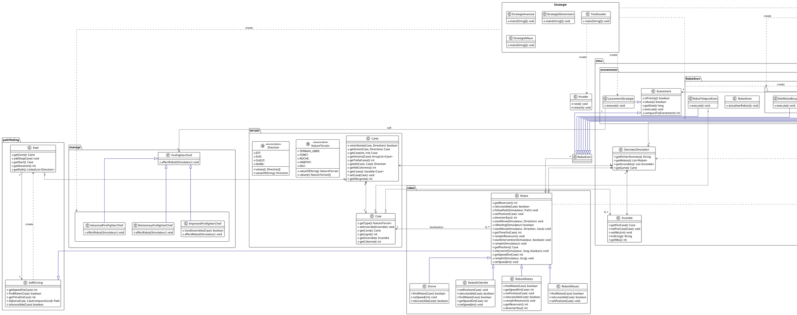

```plantuml

@startuml
!theme plain
skinparam linetype ortho

package terrain {
  class Carte {
    + voisinExiste(Case, Direction): boolean
    + getVoisin(Case, Direction): Case
    + getCase(int, int): Case
    + getVoisins(Case): ArrayList<Case>
    + getTailleCases(): int
    + getdir(Case, Case): Direction
    + getNbColonnes(): int
    + getCases(): Iterable<Case>
    + setCase(Case): void
    + getNbLignes(): int
  }
  class Case {
    + getType(): NatureTerrain
    + setIncendie(Incendie): void
    + getCarte(): Carte
    + getLigne(): int
    + getIncendie(): Incendie
    + getColonne(): int
  }
  enum NatureTerrain << enumeration >> {
    + TERRAIN_LIBRE:
    + FORET:
    + ROCHE:
    + HABITAT:
    + EAU:
    + valueOf(String): NatureTerrain
    + values(): NatureTerrain[]
  }
  enum Direction << enumeration >> {
    + EST:
    + SUD:
    + OUEST:
    + NORD:
    + values(): Direction[]
    + valueOf(String): Direction
  }
}


package simu {
  class DonneesSimulation {
    + getFichierDonnees(): String
    + getRobots(): List<Robot>
    + getIncendies(): List<Incendie>
    + getCarte(): Carte
  }
  class Incendie {
    + getFireCase(): Case
    + setFireCase(Case): void
    + setNbL(int): void
    + toString(): String
    + getNbL(): int
  }
  class Simulateur {
    + largeur_tuiles: int
    + restart(): void
    + getDateSimulation(): long
    + getDonnees(): DonneesSimulation
    + incrementeDate(): void
    + draw(): void
    + ajouteEvenement(Evenement): void
    + next(): void
    + simulationTerminee(): boolean
  }
  package evenements {
    class Evenement {
      + isPriority(): boolean
      + isAuto(): boolean
      + getDate(): long
      + execute(): void
      + compareTo(Evenement): int
    }
    class LancementStrategie {
      + execute(): void
    }
    package RobotEven {
      class RobotEven {
        + actualiserRobots(): void
      }
      package "" as ActionEven {
        class InterventionEven {
          + execute(): void
        }
        class RemplissageEven {
          + execute(): void
        }
        class RobotBougeEven {
          + execute(): void
        }
      }
      package "" as DebEven {
        class DebInterventionEven {
          + execute(): void
        }
        class DebRemplissageEven {
          + execute(): void
        }
        class DebRobotBougeEven {
          + execute(): void
        }
      }
      class RobotTeleportEven {
        + execute(): void
      }
    }
  }
}


package manage {
  package "" as FireFighterChiefType <<rectangle>> {
    class ImprovedFirefighterChief {
      + CondIncendies(Case): boolean
      + affectRobot(Simulateur): void
    }
    class ElementaryFirefighterChief {
      + affectRobot(Simulateur): void
    }
    class AdvancedFireFighterChief {
      + affectRobot(Simulateur): void
    }
  }
  class FireFighterChief {
    + affectRobot(Simulateur): void
  }
}

package scenarios {
  class Inondation {
    ~ main(String[]): void
  }
  class Scenario0 {
    ~ main(String[]): void
  }
  class Scenario1 {
    ~ main(String[]): void
  }
}


package io {
  class LecteurDonnees {
    + lire(String): DonneesSimulation
  }
}

package pathfinding {
  class Path {
    + getCarte(): Carte
    + addStep(Case): void
    + getStart(): Case
    + getDuration(): int
    + getPath(): LinkedList<Direction>
  }
  class SelfDriving {
    + getSpeedOn(Case): int
    + findWater(Case): boolean
    + getTimeOn(Case): int
    + Dijkstra(Case, CaseCompareCond): Path
    + isAccessible(Case): boolean
  }
}


package robot {
  class Robot {
    + getReservoir(): int
    + isAccessible(Case): boolean
    + followPath(Simulateur, Path): void
    + setPosition(Case): void
    + deverserEau(): int
    + startMove(Simulateur, Direction): void
    + isWaiting(Simulateur): boolean
    + startMove(Simulateur, Direction, Case): void
    + getTimeOn(Case): int
    + remplirReservoir(): void
    + startIntervention(Simulateur, boolean): void
    + remplir(Simulateur): void
    + getPosition(): Case
    + intervenir(Simulateur, long, boolean): void
    + getSpeedOn(Case): int
    + remplir(Simulateur, long): void
    + setSpeed(int): void
  }
  class RobotAChenille {
    + setPosition(Case): void
    + isAccessible(Case): boolean
    + findWater(Case): boolean
    + getSpeedOn(Case): int
    + setSpeed(int): void
  }
  class RobotAPattes {
    + findWater(Case): boolean
    + getSpeedOn(Case): int
    + setPosition(Case): void
    + isAccessible(Case): boolean
    + remplirReservoir(): void
    + getReservoir(): int
    + deverserEau(): int
  }
  class RobotARoues {
    + findWater(Case): boolean
    + isAccessible(Case): boolean
    + setPosition(Case): void
  }
  class Drone {
    + findWater(Case): boolean
    + setSpeed(int): void
    + isAccessible(Case): boolean
  }
}

package Strategie <<rectangle>> {
    class StrategieAvancee {
      ~ main(String[]): void
    }
    class StrategieElementaire {
      ~ main(String[]): void
    }
    class StrategieMieux {
      ~ main(String[]): void
    }
    class TestInvader {
      + main(String[]): void
    }  
}

class Invader {
  ~ next(): void
  ~ restart(): void
}


' ' Heritage relationships

' ## FireFighterChiefs
AdvancedFireFighterChief   -up[#000082,plain]-^  FireFighterChief
ElementaryFirefighterChief -up[#000082,plain]-^  FireFighterChief
ImprovedFirefighterChief   -up[#000082,plain]-^  FireFighterChief

' ## Evenement
LancementStrategie        -left[#000082,plain]-^  Evenement
RobotEven                 -up[#000082,plain]-^  Evenement
' ### RobotEven
RemplissageEven           -up[#000082,plain]-^  RobotEven
RobotTeleportEven         -[#000082,plain]-^  RobotEven
DebInterventionEven       -[#000082,plain]-^  RobotEven
DebRemplissageEven        -[#000082,plain]-^  RobotEven
DebRobotBougeEven         -[#000082,plain]-^  RobotEven
InterventionEven          -up[#000082,plain]-^  RobotEven
RobotBougeEven            -up[#000082,plain]-^  RobotEven

' ' ## SelfDriving
Robot                    -[#000082,plain]-^  SelfDriving
' ### Robot
Drone              -up[#000082,plain]-^  Robot
RobotAChenille     -up[#000082,plain]-^  Robot
RobotAPattes       -up[#000082,plain]-^  Robot
RobotARoues        -up[#000082,plain]-^  Robot


' ## DonneesSimulation
DonneesSimulation    "1" *-left[#595959,plain]-> Carte
DonneesSimulation    "*" *-down[#595959,plain]-> Incendie
DonneesSimulation    *-down[#595959,plain]-> "*" Robot

Carte             "*" *-[#595959,plain]-> "1" Case

Case              "1" o-right[#595959,plain]-> "0..1" Incendie

LancementStrategie   "1" -[#595959,plain]-> "1" FireFighterChief    : call

Path          "*" o-[#595959,plain]-> "1" Carte
Path          "*" o-[#595959,plain]-> "1" SelfDriving

RobotEven      "*" -[#595959,plain]-> "1" Robot

Robot               "0..*" -left[#595959,plain]--> "1" Case                           : "localisation"

RobotTeleportEven    "1" -[#595959,plain]-> "1" Case

Simulateur           "1" o-[#595959,plain]-> "1" DonneesSimulation
Simulateur           "1" *-left[#595959,plain]-> "*" Evenement

scenarios                    --[#595959,dashed]->  Simulateur                         : "«create»"

LecteurDonnees             --down[#595959,dashed]->  DonneesSimulation                  : "«create»"

Robot                   --[#595959,dashed]->  ActionEven                   : "«create»"


scenarios                     --[#595959,dashed]->  DebEven                : "«create»"

SelfDriving       --[#595959,dashed]->  Path                        : "«create»"

Strategie                       --right[#595959,dashed]->  LecteurDonnees                  : "calls"
Strategie                       --[#595959,dashed]->  FireFighterChiefType                  : "create"
Strategie                       --[#595959,dashed]->  LancementStrategie                 : "create"
Strategie                       --[#595959,dashed]->  Simulateur                         : "create"

TestInvader                   --[#595959,dashed]->  Invader                                 : "«create»"

@enduml
```